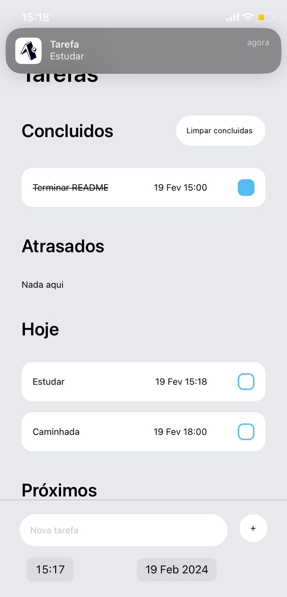
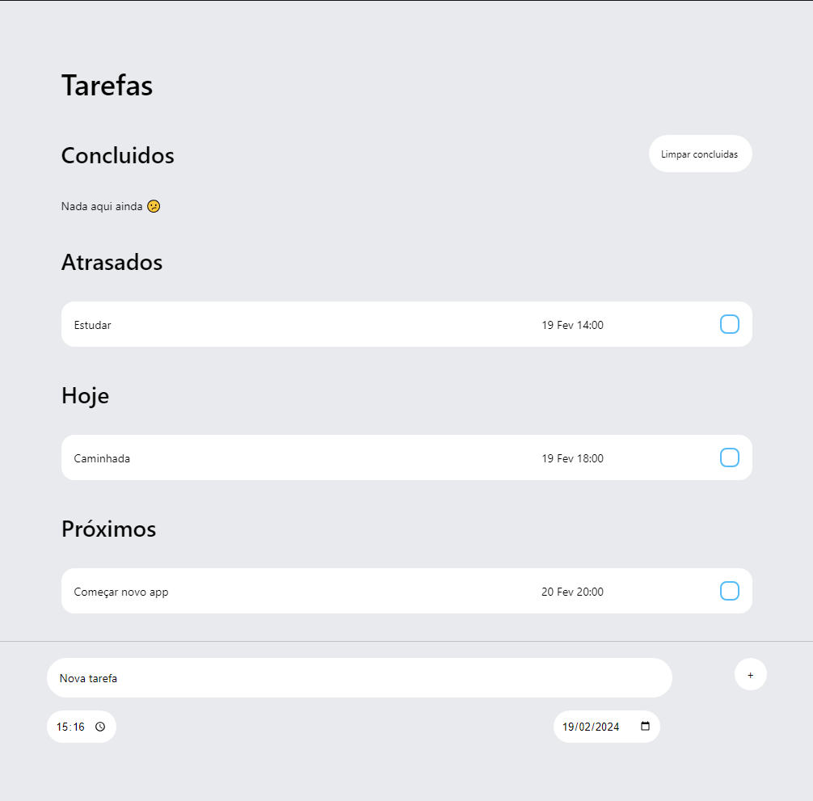

# todo-app-native 📑

React native app com expo para mobile e web. 
Crie tarefas com título, data e hora, marque como concluido e exclua. Visualize tarefas para o dia atual, atrasadas ou para o resto da semana; com notificações para mobile.

- [Design e tutorial base](https://www.youtube.com/watch?v=0kL6nhutjQ8)
- [Algoritmo base para notificações](https://www.lahoregraphix.com/how-to-send-push-notification-in-react-native-expo-2023/)

### To do
- ✅ INSERIR DATA E HORA
- ✅ ARRUMAR SCROLL NO MOBILE
- ✅ ORGANIZAR POR ORDEM CRONOLOGICA
- ✅ ARRUMAR INPUT DE DATE E TIME NO WEB
- ✅ PUSH NOTIFICATIONS
- ✅ ADICIONAR IMAGENS AO README

